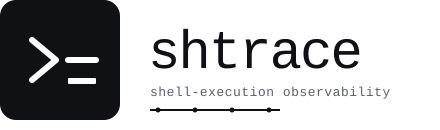

# shtrace

<picture>
  <source media="(prefers-color-scheme: dark)" srcset="docs/shtrace-logo-dark.svg">
  
</picture>

[](https://github.com/harakeishi/shtrace/actions/workflows/ci.yml)
[](https://pkg.go.dev/github.com/harakeishi/shtrace)
[](https://goreportcard.com/report/github.com/harakeishi/shtrace)
[](./LICENSE)
[](https://go.dev/doc/go1.25)

> Shell-execution observability for AI-era engineering. Wrap a command, get a
> searchable, replayable record of what actually happened.

`shtrace` is a single Go binary that wraps any shell command and records its
stdout/stderr, exit code, working directory, and timing into a local on-disk
store. It is built so that humans (and AI agents) can later answer questions
like "did this test actually run?", "what did `pytest` print on that failed
CI job?", or "what changed between these two runs?" — without sending data to
a SaaS.

## Status

**Phase 1–4 complete — alpha.** The collector (PTY/pipe modes, FTS5 search,
GC, secret masking), MCP stdio server, HTML report, export/import, GitHub
Actions integration, `shtrace pr-comment`, and the `shtrace serve` web UI all
ship today. See [Roadmap](#roadmap).

## Why

Existing tools cover adjacent ground but not this one:

- Shell-history MCPs (e.g. `terminal-history-mcp`) record **what was run**,
  not **what was printed**.
- `tlog` / `sudoreplay` / `auditd` record PTY sessions for security audit,
  not for CI/AI verification.
- LLM observability (Langfuse, LangSmith, …) traces model calls, not the
  shell commands those agents execute.
- OpenTelemetry shell wrappers (`otel-cli`) emit spans but discard output.

`shtrace` records the **command + the full output stream + metadata**, in a
unified format that works the same way locally and in CI, and stays
self-hosted by design.

For the full design rationale, see the planning document referenced in the
repo history.

## Installation

Requires Go 1.24+.

```sh
go install github.com/harakeishi/shtrace/cmd/shtrace@latest
```

Or build from source:

```sh
git clone https://github.com/harakeishi/shtrace
cd shtrace
go build ./cmd/shtrace
```

The result is a single static binary with no CGo dependency (uses
`modernc.org/sqlite`).

## Quickstart

Wrap any command:

```sh
shtrace -- go test ./...
shtrace -- pytest tests/
shtrace -- sh -c 'echo hello; echo oops >&2; exit 3'
```

The wrapped command's stdout, stderr, and exit code pass through unchanged.
Everything is also recorded.

List recent sessions:

```sh
$ shtrace ls
2026-05-12T10:00:00Z  019e1cb2-…  spans=1  sh
2026-05-12T09:55:00Z  019e1cb1-…  spans=4  go
```

Inspect a session:

```sh
$ shtrace show <session-id>
== span 019e1cb2-…  cmd=sh  exit=3  mode=pipe
hello
oops
```

`show` routes recorded stdout to its own stdout and recorded stderr to its
own stderr, so `shtrace show <id> > out.log 2> err.log` separates them again.

JSON output for scripting:

```sh
shtrace ls --json | jq '.[0].id'
```

## HTML report

`shtrace report` renders one session into a single self-contained HTML file
(inline CSS, no external assets) that can be opened with `file://` — no
server needed. This is what reviewers will open after downloading the GitHub
Actions artifact in the Phase 3 PR-verification flow.

```sh
shtrace report --latest --output report.html
# or pick an explicit session:
shtrace report --session <session-id> --output report.html
# or stream to stdout for piping:
shtrace report --latest > report.html
```

The report includes session metadata, a chronological timeline of spans,
each span's stdout/stderr (colour-coded), exit code, mode, and duration.
Browser find-in-page (Ctrl/Cmd+F) is sufficient for the Phase 3 scope; full
text search and asciinema-style replay live in Phase 4.

## Export and import

Export a session as a self-contained `.tar.gz` artifact (for sharing via
GitHub Actions or between machines):

```sh
shtrace export --latest --output session.tar.gz
# Include an HTML report in the archive:
shtrace export --latest --with-report --output session.tar.gz
# Export a specific session:
shtrace export --session <session-id> --output session.tar.gz
```

The archive contains `manifest.json`, `session.json`, span output logs, and
optionally `report.html`.

Import a previously exported archive into the local store:

```sh
shtrace import session.tar.gz
# Overwrite if the session ID already exists:
shtrace import session.tar.gz --overwrite
# Generate a new ID on collision (original ID is preserved in metadata):
shtrace import session.tar.gz --rename
```

## MCP server

`shtrace mcp` starts a Model Context Protocol server over stdio (JSON-RPC 2.0).
AI agents can use it to query recorded execution history without any SaaS:

```sh
shtrace mcp
```

Available tools:

| Tool | Description |
|---|---|
| `get_session` | Return all spans and output for a session |
| `search_commands` | Full-text search across recorded output |
| `detect_test_runs` | Identify test framework invocations in a session |
| `compare_runs` | Diff two sessions — highlights regressions and new failures |

Wire it up in your MCP client config as a stdio server with command `shtrace mcp`.

## Web UI

`shtrace serve` starts a local HTTP server with a single-page UI for browsing
sessions without touching the command line:

```sh
shtrace serve                  # default port 7474
shtrace serve --port 8080
```

The UI lists recent sessions, shows span output with stdout/stderr colour-coding,
and supports full-text search. It is served at `http://127.0.0.1:<port>` and
only listens on loopback — no network exposure.

## GitHub Actions integration

Copy `.github/workflows/shtrace-sample.yml` from this repo into your own
repository as a starting point. It records test runs with shtrace, uploads
the session as a workflow artifact, and posts a PR comment with a test-result
summary and artifact download instructions.

### `shtrace pr-comment`

Posts a comment to a GitHub PR summarising the recorded session. Designed to
run inside GitHub Actions where `GITHUB_TOKEN` and `GITHUB_REPOSITORY` are
set automatically:

```sh
shtrace pr-comment --latest --pr 42
# or with an explicit session:
shtrace pr-comment --session <id> --pr 42
```

## Automatic session grouping

Runs launched by the same parent process are grouped into one session
automatically — no configuration required. This matters most for AI agents,
which typically spawn a throwaway shell per command: one agent instance
becomes one session, and each command becomes a span within it.

```sh
shtrace -- go test ./...
shtrace -- pytest tests/
shtrace ls          # both runs appear under a single session
```

The session for an invocation is resolved in this order:

1. `SHTRACE_SESSION_ID`, when set — nested calls, CI jobs, and containers keep
   their existing behaviour and join that session explicitly.
2. The session already claimed by this invocation's parent process, if any.
3. Otherwise a fresh session, which the parent then claims.

The parent is identified by its pid *and* start time, so a recycled pid cannot
merge unrelated runs. If the start time cannot be read, grouping is skipped and
the run starts its own session — the behaviour before grouping existed.

### `shell-init` (deprecated)

`shtrace shell-init` predates automatic grouping and is no longer needed in
normal use. It still works, and remains useful when you want every command in
a terminal pinned to one explicit session id regardless of process ancestry,
or when running on a platform where the parent's start time is unavailable:

```sh
# ~/.bashrc  (or ~/.zshrc)
eval "$(shtrace shell-init bash)"   # use zsh for zsh
```

If `SHTRACE_SESSION_ID` is already set (e.g. from a parent CI job), the
snippet is a no-op, so it is safe to add unconditionally.

You can also generate a session ID manually:

```sh
export SHTRACE_SESSION_ID="$(shtrace session new)"
```

## Automatic wrapping (experimental)

By default `shtrace` only records what you explicitly wrap. If you want an AI
coding agent (Claude Code, Codex, …) to have *every* command it runs recorded
without teaching it about `shtrace`, opt in to auto-wrap:

```sh
shtrace enable     # install shims + rc hooks
shtrace doctor     # verify the setup actually wraps
shtrace disable    # remove everything
```

Open a new shell (or restart the agent) for the change to take effect.

### How it works

Agents ultimately run their commands through `bash -c` / `zsh -c`, so
replacing the entry point to the shell is enough to catch everything an agent
does — the outermost shell is wrapped, and all descendant output flows through
that one recording.

`shtrace enable` installs two complementary mechanisms:

1. **PATH shims** — `~/.shtrace/shims/{bash,zsh,sh}` are placed ahead of the
   real shells on `PATH`. Each shim `exec`s `shtrace -- <real shell> "$@"`.
   The absolute path of the real shell and of the `shtrace` binary are
   resolved and baked in at `enable` time, so the shim never resolves to
   itself.
2. **Startup-file hooks** — an agent that invokes `/bin/bash` by absolute path
   bypasses `PATH` entirely. `~/.shtrace/bashenv.sh` (armed via `BASH_ENV`) and
   a block in `~/.zshenv` re-exec the shell under `shtrace` when
   `BASH_EXECUTION_STRING` / `ZSH_EXECUTION_STRING` is non-empty — i.e. only
   for `-c` command strings.

Both the `PATH` entry and `BASH_ENV` are set from `~/.bashrc` *and* `~/.zshenv`,
because a zsh terminal never reads `~/.bashrc`. Without the zsh copy, an agent
started from a zsh shell would get neither the shims nor absolute-path capture.

Two guards keep wrapping from running away: `SHTRACE_AUTOWRAP_ACTIVE` is
exported before the wrapping `exec`, so any shell deeper in the same process
tree passes straight through (no double wrapping), and an invocation with no
arguments or with `-i` is treated as interactive and left alone.

### Using auto-wrap with `shell-init`

The two compose. `shell-init` exports `SHTRACE_SESSION_ID` for a terminal, and
auto-wrap deliberately does *not* gate on that variable — it uses
`SHTRACE_AUTOWRAP_ACTIVE` instead. Commands an agent runs in such a terminal
are therefore still wrapped, and they join the terminal's session as child
spans rather than starting sessions of their own:

```sh
shtrace show "$SHTRACE_SESSION_ID"   # terminal session, with agent commands as spans
```

Gating on `SHTRACE_SESSION_ID` would silently disable auto-wrap for exactly the
users who enabled both features.

All rc edits live between `# >>> shtrace auto-wrap >>>` and
`# <<< shtrace auto-wrap <<<` markers, are written atomically, and never touch
content outside the block. Re-running `enable` replaces the block in place, so
it is safe to run repeatedly.

### Limitations

- **Interactive shells are not wrapped.** v1 deliberately stays out of the way
  of a human at a prompt; use `shtrace shell` for that.
- **Absolute-path `dash` (and other POSIX `sh`) is not captured.** The `sh`
  shim covers `PATH` lookups, but shells without a `BASH_ENV` equivalent
  cannot be hooked when invoked by absolute path.
- **A bash login shell reads `~/.bash_profile`, not `~/.bashrc`** (this is the
  default for a macOS terminal), so auto-wrap does not activate there unless
  `~/.bash_profile` sources `~/.bashrc` — the common arrangement, but not
  guaranteed. Add `[ -f ~/.bashrc ] && . ~/.bashrc` to `~/.bash_profile` if
  `shtrace doctor` reports the PATH entry as NG in a new terminal.
- **Disk usage grows quickly**, since every agent command is now recorded. Run
  `shtrace gc` periodically, or set `SHTRACE_TTL_DAYS` / `SHTRACE_MAX_SIZE_BYTES`.
- The shims bake in absolute paths at `enable` time. Re-run `shtrace enable`
  after moving or upgrading the `shtrace` binary or your shells.

## How it works

### Recording modes

- **mode B (pipe)** — when shtrace's stdout is not a TTY (CI, redirects,
  pipes). Captures stdout and stderr as separate streams.
- **mode A (PTY)** — when shtrace's stdout is a TTY. Allocates a PTY to
  preserve color/progress-bar output; the recorded stream is labelled
  `pty` because the kernel interleaves stdout/stderr onto the same fd.
  Pass `--mode pipe` to force pipe mode even on a TTY (useful for
  reproducing CI behaviour locally).

Both modes share a single on-disk JSON Lines schema (`stream` field
disambiguates `stdout` / `stderr` / `pty`).

### Secret masking (fail-secure)

The recorded log is scrubbed; the user's own terminal stream is left
untouched. Built-in patterns cover:

- AWS access key ids (`AKIA…`/`ASIA…`) and secret access keys anchored to a
  nearby key name (`AWS_SECRET_ACCESS_KEY=…`, `--secret-access-key …`)
- GitHub PATs — classic (`ghp_…`/`gho_…`/`ghu_…`/`ghs_…`/`ghr_…`) and
  fine-grained (`github_pat_…`)
- OpenAI keys, including `sk-proj-…` project keys
- Slack tokens (`xoxb-`/`xoxp-`/`xoxa-`/`xoxs-`/`xapp-`)
- Google API keys (`AIza…`)
- `Bearer …` header values and JWTs (`eyJ….….…`)
- Passwords in connection URLs (`postgres://user:pw@host`)
- PEM private-key blocks, body included
- A generic `NAME=VALUE` fallback for names containing `token`, `secret`,
  `password`, `passwd`, or `api_key`

Masking is line-oriented and streaming: the masker buffers a trailing window
between reads so a secret straddling a pipe-buffer boundary still gets
caught, and holds an incomplete line until its newline arrives so output is
identical regardless of how reads happen to split it.

Behaviour worth knowing when judging coverage:

- **Prefixes are preserved** so masked output stays diagnosable: the scheme,
  user and host of a URL, the key name in an assignment, and the `Bearer`
  keyword survive; only the credential becomes `***`.
- **Unexpanded variable references are left alone** — `$NAME`, `${NAME}`,
  `$(cmd)` and `%NAME%` are what a script echoes before expansion, so
  redacting them would hide context without hiding a secret. A default
  *value* is not exempt: `${DB_PASS:-hunter2}` is masked.
- **The generic fallback needs a value of 6+ characters**, so prose like
  `password: ` or `token: n/a` is not redacted.
- **PEM blocks** are masked in full — every line between `BEGIN` and `END`,
  including the short final line — when they pass through the streaming
  masker, which is every recorded stream. A PEM body line masked in
  isolation (no `BEGIN` marker in the same buffer) still needs 60+ base64
  characters to be recognised on its own. A `BEGIN` marker with no matching
  `END` masks the remainder of that command's output.

Masking is a safety net, not a guarantee: a credential in a format no
pattern describes will be recorded as-is.

> **Interactive input can land in the recording (mode A / PTY).**
> shtrace never records your stdin directly, but in PTY mode the kernel's
> line discipline echoes what you type back onto the PTY master — and that
> echo *is* recorded. Turning echo off (as `sudo`, `ssh`, and `read -s`
> do) does not reliably prevent this: shtrace can forward input before the
> child has finished calling `stty -echo`, and those bytes are echoed and
> recorded. With piped or pasted input the input almost always wins that
> race. Anything typed at such a prompt is masked only if it matches a
> built-in pattern, and a password generally does not.
>
> This affects `shtrace shell` and `shtrace -- <cmd>` whenever stdout is a
> TTY. Avoid entering secrets under shtrace; use `--mode pipe`, which does
> not echo stdin into the recording, when you must.

### Session/span propagation

Each invocation gets a UUIDv7 `span_id`. The root invocation gets a fresh
`session_id`; nested `shtrace` calls inherit it via three environment
variables:

| Variable | Purpose |
|---|---|
| `SHTRACE_SESSION_ID` | Joins an existing session |
| `SHTRACE_PARENT_SPAN_ID` | Parent of the new span |
| `SHTRACE_TAGS` | JSON object propagated to all child spans |

This means `shtrace make all` whose `Makefile` calls `shtrace pytest` records
one session containing both spans, with parent/child linkage preserved.

When no `SHTRACE_SESSION_ID` is inherited, the invocation falls back to
[parent-process grouping](#automatic-session-grouping) instead of always
starting a new session.

### Storage layout

```
$DATA_DIR/
├── sessions.db                       # SQLite (WAL), metadata only
└── outputs/<session_id>/<span_id>.log # JSON Lines, one chunk per line
```

`$DATA_DIR` is resolved in this order:

1. `$SHTRACE_DATA_DIR` (explicit override)
2. `$GITHUB_WORKSPACE/.shtrace` when `GITHUB_ACTIONS=true`
3. `$XDG_DATA_HOME/shtrace`
4. `~/.local/share/shtrace` (Linux)
5. `~/Library/Application Support/shtrace` (macOS)

A single corrupt row in `sessions.db` does **not** take the whole listing
offline — the row is skipped and a warning is printed to stderr.

## Configuration

All configuration is via environment variables. There is no config file (by
design — CI integration should be a single env var, not a checked-in file).

| Variable | Default | Purpose |
|---|---|---|
| `SHTRACE_DATA_DIR` | platform-specific | Where to store sessions and logs |
| `SHTRACE_SESSION_ID` | unset (new session) | Join an existing session |
| `SHTRACE_PARENT_SPAN_ID` | unset | Parent span id for nested calls |
| `SHTRACE_TAGS` | `{}` | JSON object of tags propagated to child spans |
| `SHTRACE_AUTOWRAP_ACTIVE` | unset | Set by auto-wrap shims to prevent double wrapping; not intended to be set by hand |

## Roadmap

| Phase | Scope | Status |
|---|---|---|
| 1. Collector MVP | `shtrace <cmd>`, `ls`, `show`, mode A (PTY) + mode B (pipe), `search` (FTS5), `gc`, secret masking (patterns + entropy), session propagation, SQLite + JSON Lines, `shell-init` | done |
| 2. MCP server | `shtrace mcp` stdio server with `get_session`, `search_commands`, `detect_test_runs`, `compare_runs` | done |
| 3. PR verification + HTML report | `shtrace report`, `shtrace export/import`, GitHub Actions workflow, `shtrace pr-comment` | done |
| 4. Web UI | `shtrace serve` with session list, span viewer, full-text search | done |
| 5. attest layer | AI execution-verification score | stretch goal |

## Non-goals

- SaaS hosting
- Multi-host aggregation
- Telemetry of any kind (the binary never phones home)
- Windows support (Linux and macOS only)
- Implicit, always-on shell hooks — explicit wrapping remains the principle:
  `shtrace` records what it is asked to wrap. Auto-wrap exists, but only as an
  opt-in the user turns on with `shtrace enable` and can fully remove with
  `shtrace disable` (see [Automatic wrapping](#automatic-wrapping-experimental))

## Contributing

This is a personal OSS project. Issues and PRs welcome; please open an issue
before starting non-trivial work so we can agree on scope.

Development workflow:

```sh
go test -race ./...      # all tests must pass under -race
go vet ./...
go test -bench=. ./...   # benchmarks must stay green; see SLIs below
```

The codebase follows a strict TDD discipline — write a failing test first,
then the minimum implementation that makes it pass.

### Performance SLIs

`shtrace` is a wrapper, so its overhead has to be invisible against the
wrapped command. Concrete SLIs (committed-to ceilings, all measured as
**mean ns/op** by `go test -bench`; aggregate across `-count=N` runs with
`benchstat` if you need a distribution):

| SLI | Target (mean) | Benchmark |
|---|---|---|
| Wrapping a near-zero-output command (spawn floor) | wrapped wall-clock of `sh -c 'printf hi'` < 5 ms | `BenchmarkRunPipe_SpawnFloor` |
| Masker + recorder streaming throughput (in-process, no child) | ≥ 10 MB/s for printable ASCII | `BenchmarkForwardStream_Throughput` (reports MB/s) |
| Span insert (sqlite WAL, `synchronous=NORMAL`) | `InsertSpan` < 5 ms | `BenchmarkInsertSpan` |
| Session list (50 rows out of 1 000) | < 10 ms | `BenchmarkListSessions` |
| Spans-for-session (100 rows) | < 10 ms | `BenchmarkSpansForSession` |
| FTS first-time index of one span (100 lines, fresh `span_id`) | < 10 ms | `BenchmarkFTSIndexSpan` |
| FTS search across 100 indexed spans (~20 % selectivity) | < 20 ms | `BenchmarkFTSSearch` |

The spawn-floor SLI measures wrapped wall-clock, not "wrapper overhead
relative to a bare command" — the latter requires a separate baseline run
and is currently out of scope. The storage SLIs assume the pragma settings
applied by `storage.Open` (WAL journal, default `synchronous=NORMAL`); if a
future change tightens durability to `FULL`, retune the ceilings or document
the new floor.

These targets are intentionally generous for the v0.x line — the goal is to
catch regressions, not to chase microseconds. Once shtrace is integrated into
a real pytest/Go test suite (Phase 3.5), the headline SLI becomes "`shtrace
pytest tests/` adds ≤ X % wall-clock over a bare `pytest tests/` on the same
host", with X to be pinned from production measurements.

## License

Apache-2.0. See [LICENSE](./LICENSE).
